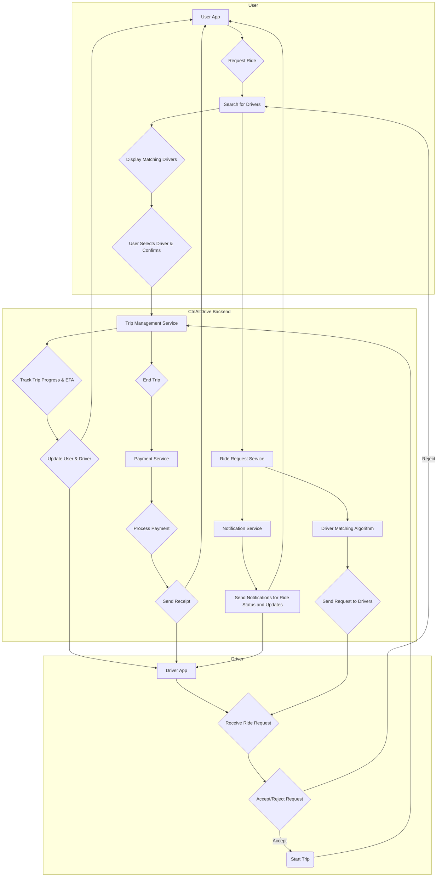

# CtrlAltDrive: Ride-Hailing Reimagined 🚗💨

CtrlAltDrive is a ride-hailing application built with a microservices architecture, designed to provide a safer, more reliable, and user-centric experience. This document outlines the project's core features, architecture, and implementation plan. 

## Addressing Pain Points in Existing Services:

**1. Unreliable ETAs and Trip Tracking:**

*   **Pain Point:** Inaccurate ETAs and glitchy real-time tracking.
*   **CtrlAltDrive Solution:**
    *   **Enhanced Location Services:** High-accuracy GPS and sensor fusion for smoother tracking.
    *   **Traffic Pattern Analysis:** Machine learning models for real-time ETA predictions.
    *   **Proactive Notifications:** Alerts for potential delays before they significantly impact the ETA.

**2. Safety Concerns:**

*   **Pain Point:** Rider and driver safety, especially during late-night rides.
*   **CtrlAltDrive Solution:**
    *   **Advanced Driver Verification:** Multi-factor authentication, continuous background checks, and facial recognition login.
    *   **In-App SOS Feature:** A dedicated panic button that connects to emergency services and notifies pre-selected contacts.
    *   **Ride Sharing Options:** Easy trip detail sharing with trusted contacts. Option to request rides with friends and split fares.

**3. Surge Pricing Frustration:**

*   **Pain Point:** Unpredictable and excessive surge pricing.
*   **CtrlAltDrive Solution:**
    *   **Transparent Surge Calculation:** Clear explanations of surge pricing factors before booking.
    *   **Fare Locking Options:** Ability to lock in a fare, even if surge pricing increases.
    *   **Alternative Transportation:** Integration of ride-sharing, public transport, and micro-mobility options.

**4. Limited Accessibility Options:**

*   **Pain Point:**  Lack of adequate accessibility features.
*   **CtrlAltDrive Solution:**
    *   **Comprehensive Accessibility Settings:** Matching riders with appropriately equipped drivers and vehicles.
    *   **Text-to-Speech and Larger Text:** Improved usability for visually impaired users.
    *   **Haptic Feedback:** Vibration-based notifications for users with hearing impairments.

## System Architecture

### Flowchart


### Microservices:
The project leverages a microservices architecture to enhance scalability, maintainability, and fault tolerance. The key services include:

1.  **User Service (Golang):** Manages user accounts, profiles (including accessibility preferences and emergency contacts), and ride history.
2.  **Driver Service (Golang):** Handles driver registration, verification, real-time availability, and status tracking.
3.  **Ride Request Service (Golang):**  Processes ride requests, implements a smart matching algorithm considering user preferences and accessibility needs, and manages surge pricing.
4.  **Trip Management Service (Golang):**  Tracks active trips, provides real-time location updates, estimates ETAs, and facilitates communication between riders and drivers.
5.  **Payment Service (Java/Python):**  Processes payments, handles split fares, manages fare locking options, and ensures secure transactions.
6.  **Notification Service (Rust):** Sends ride status updates, alerts, and notifications in multiple languages, allowing for customizable notification settings.

## Technology Stack:

*   **Backend:**  Golang (primary), Java/Python (payment), Rust (notifications)
*   **Frontend:** React 
*   **Databases:** PostgreSQL (primary), MongoDB (geospatial data)
*   **Messaging:** RabbitMQ/Kafka
*   **API Gateway:** Kong/AWS API Gateway

## Project Structure and Repositories:

The project will be divided into separate repositories for each microservice and the frontend:

**Microservices:**

*   `ctrlaltdrive-user-service` (Golang)
*   `ctrlaltdrive-driver-service` (Golang)
*   `ctrlaltdrive-ride-request-service` (Golang)
*   `ctrlaltdrive-trip-management-service` (Golang)
*   `ctrlaltdrive-payment-service` (Java/Python)
*   `ctrlaltdrive-notification-service` (Rust)

**Frontend:**

*   `ctrlaltdrive-frontend` (React)

**Optional but Recommended:**

*   `ctrlaltdrive-api-gateway`: For a custom API Gateway implementation.
*   `ctrlaltdrive-common`: To house shared code and libraries used across services.

## Key Points:

*   **Data-Driven Decisions:** Continuously improve algorithms based on collected data.
*   **Iterative Development:** Start with an MVP and add features incrementally.
*   **Scalability and Reliability:** The microservices architecture ensures the application can handle a growing user base.
*   **Security:**  Prioritize user data protection and secure payment processing.

## Getting Started:

Detailed documentation and setup instructions for each microservice and the frontend can be found in the respective repositories.

## Developers:
* **[Your Name/GitHub Username]** -  [A brief description of your role and contributions] 

```

Remember to replace placeholders like `[Your Name/GitHub Username]` and add any other relevant details to make the README comprehensive. 
